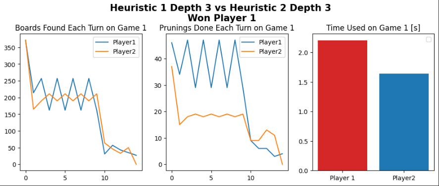
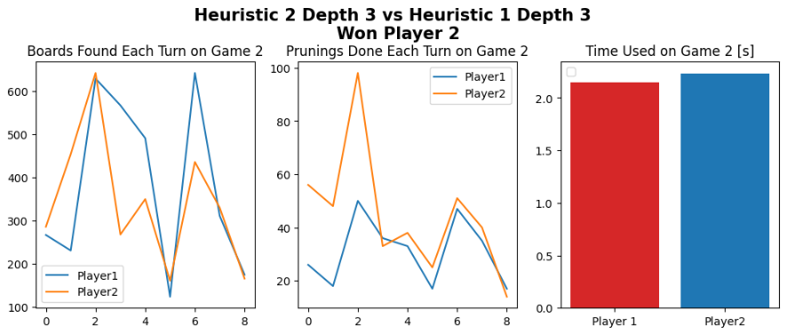
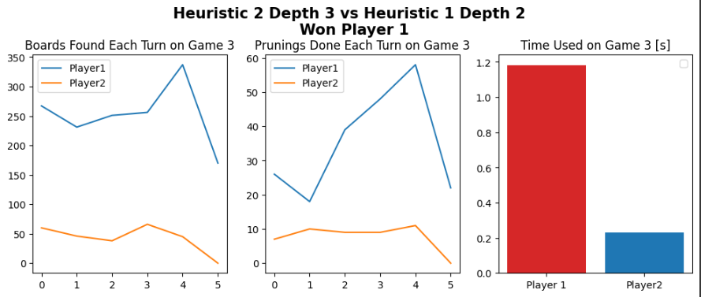
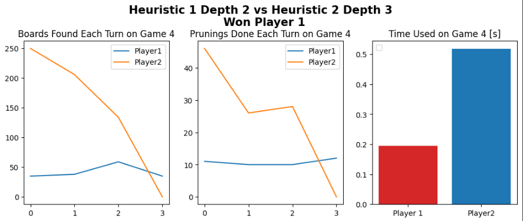
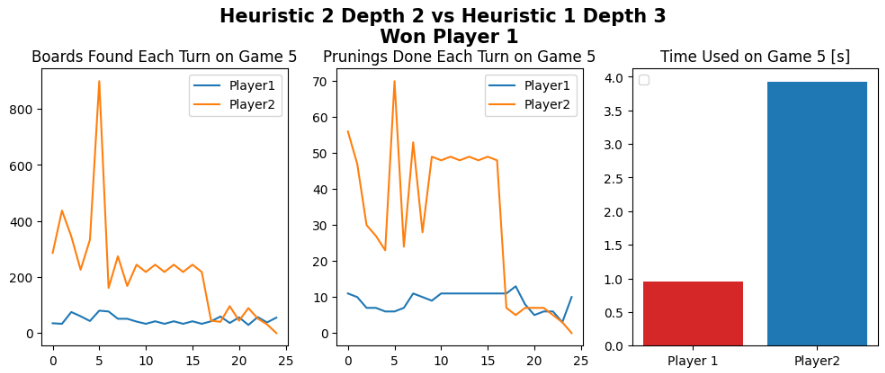
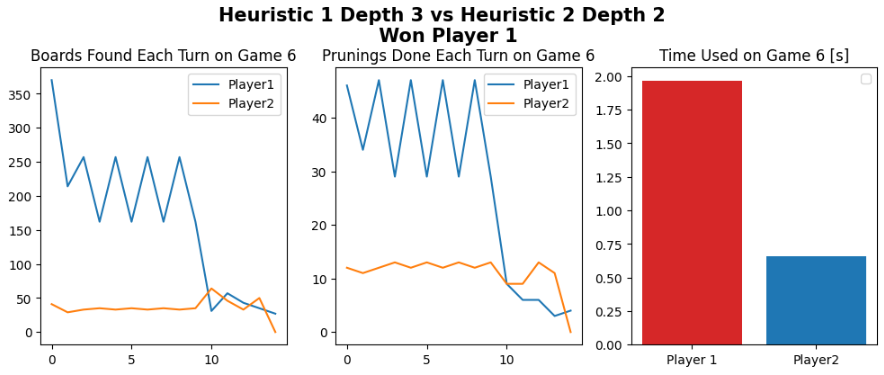

# Installation Guide
Install libraries:

    * pip install -r requirements.txt
Run app.py:

    * python .\Src\app.py
# Test MinMax WithDepth(cut-off) with 2 (or more) different heuristics, which one is better?

We tested 2 different heuristics. Both heuristics assign values to each check to see if the game is over, based on whether a piece fulfills certain conditions. The difference between the two heuristics is:

    1. The utility results of each check will be summed.
    2. The overall utility value will be the maximum of each check.

Additionally, the final result will be multiplied by *20 if it is a winning state.

We chose these heuristics because they are two similar but different concepts. The first heuristic chooses a position where there are more moves that lead to victory, while the second heuristic chooses a position where there is a safer way to win.

These different ideas lead the bot to think about whether it is better to have a position where a rival's mistake leads to victory or a bot that sees the victory and focuses on it.

The first thing we did before testing the heuristics was to determine which depth was best to use when facing the heuristics using our best possible bot:

Based on our testing, we found that using depth 3 and 2 resulted in better performance for our bots. This may seem counterintuitive, but it's because our heuristics are focused on winning rather than considering the opponent's possible moves, so bots that see victories in fewer moves tend to perform better.

After determining the best depths, we had our bots play against each other, and the results were as follows:

    * gamereport 1 = heuristic 1 with depth 3 as black won against heuristic 2 with depth 3 as white
    * gamereport 2 = heuristic 1 with depth 3 as white won against heuristic 2 with depth 3 as black
    * gamereport 3 = heuristic 2 with depth 3 as black won against heuristic 1 with depth 2 as white
    * gamereport 4 = heuristic 1 with depth 2 as black won against heuristic 2 with depth 3 as white
    * gamereport 5 = heuristic 2 with depth 2 as black won against heuristic 1 with depth 3 as white
    * gamereport 6 = heuristic 1 with depth 3 as black won against heuristic 2 with depth 2 as white 

(more of this in question 3)

We concluded that while the two heuristics perform similarly, heuristic 1 is generally better than heuristic 2 when using the same depth. Therefore, we recommend using heuristic 1, which considers the sum of different utility results. Additionally, having the first move gives an advantage over the opponent, so it's also important to take that into consideration.

# Run the MinMax + α − β pruning algorithm and report a graph of #turn vs #pruning. Change the order of actions (to expand from the right) and report the same graph. Is it different? Why?

We ran the + α − β pruning algorithm using the same depth to find the best order of actions that results in the highest number of prunings. Initially, we manually changed the order of actions, but then we decided to use a randomizer to change the order of moves randomly each time. By doing this, we obtained the following graphs.

After running the MinMax + α − β pruning algorithm to find the best order of actions to achieve the highest number of prunings, we initially tried manually changing the order of actions, but later implemented a randomizer to change the order of actions randomly for each sub-board generated. The resulting graph showed that using random moves could lead to more prunings and terminal boards, but it was also more likely to find an order of actions that was more harmful than beneficial.

Taking this into account, we ultimately decided on the best order of actions: SE, SW, NE, NW, E, W, S, N. Through trial and error, we discovered that bots tend to perform better when ending games by moving from the center towards the corners. Therefore, it is more likely to find terminal boards when the order of actions involves diagonal movements that aim to reach these corners.

In this case, the best order of actions is either order 2 or order 5, which start with an Eastward move, followed by a Northeast or Southeast move, and then a Northwest or Southwest move. These movements signify an attempt to gather pieces in the Northeast or Northwest, or Southeast or Southwest corners. This idea of gathering pieces in a corner is a simple yet effective strategy, and our experiments have shown that it is better than making random moves or non-diagonal moves.

Through these experiments, we have found that a human-like strategy of seeking out corners with pieces and moving from the center towards these corners results in better outcomes than making random or non-diagonal moves.

# Run the game once and report a graph of #turn vs #expanded states for the MinMax + α − β pruning and MinMaxWithDepth(cut-off) algorithms.

Using the games seen in question number 1, we also managed to obtain the graph of #turn vs #expanded states when our algorithms faced each other. With this, we can see the following graphs:

Looking at these graphs, we can see that depending on the depth and heuristic we use, we will have different results, as we never had the same results. The only thing we could notice is that at the beginning, more states are expanded than later on, which goes hand in hand with the number of prunings we make. Each turn, the bot expands in fewer states, and the number of prunings decreases. However, this is a generalization as we can see in games like game 2 and game 5, where this does not always happen. These expanded states change a lot due to the low depth we have for this specific game, and depending on the moves, more or fewer states will be expanded. As we progress through the game tree, we will be getting closer to possible game-winning positions, and hence the expanded states will decrease. With greater depth, we will see that the graphs are more refined, and we will see that the expanded states are always more at the beginning than later on.

Another thing we can notice is that in the graphs where there was a "collision" between the two players when they found the same number of expanded states, such as in game 2, which was won by the white player. Hence, we can conclude that expanding in more states is essential if you want to approach a winning position. In our other games, player 1 expands to many more states than player 2, and hence we have that in the majority of games, player 1 wins.

# conclusions

After running the game many times and trying different heuristics, we found that creating a bot to play Cuatela is harder than initially thought. For board games like this, the most crucial part is developing a heuristic that encompasses all aspects of the game, identifying all ways to win while also avoiding losses. Many more tests need to be conducted with heuristics to find a bot that can "solve" the game.

We also need to consider that like chess, Cuatela has the flaw that the first player to move has the advantage, and the second player to move, if they make the same moves, will not win. Therefore, the heuristic must consider all aspects of the game to be truly powerful.

If the heuristic is not the best one available, then increasing the depth will not fix the problems with that heuristic. Therefore, to truly create a bot that can win against all others and be omnipotent, careful consideration must be given to the heuristic used, as it is the most critical part of such programs.

### Created By

    1. Cari Nicolas
    2. Rivero Christian